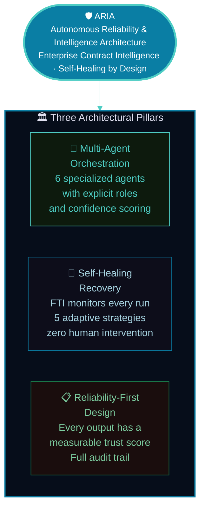
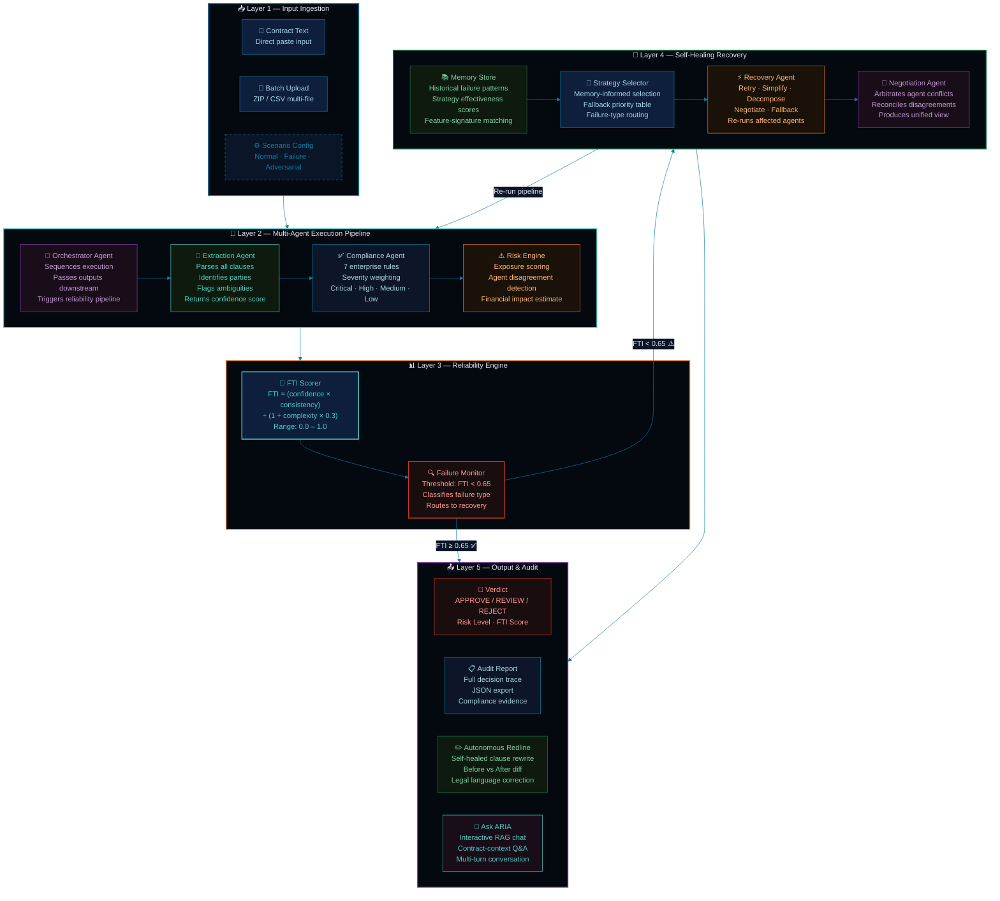
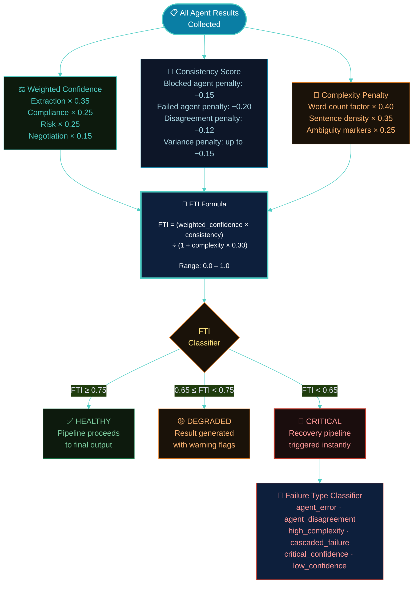
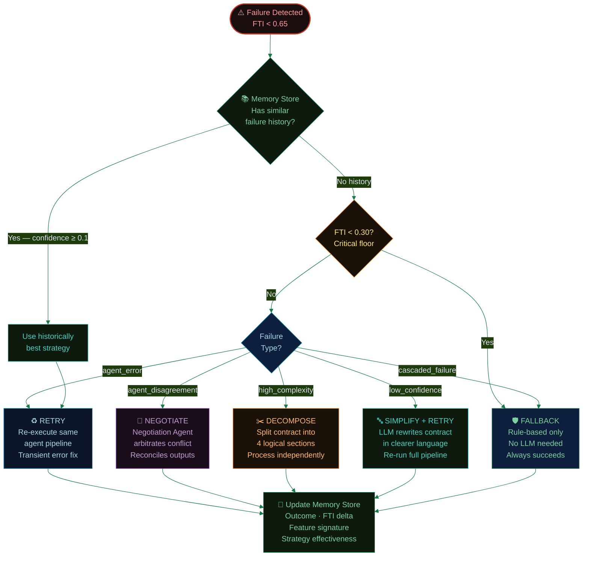
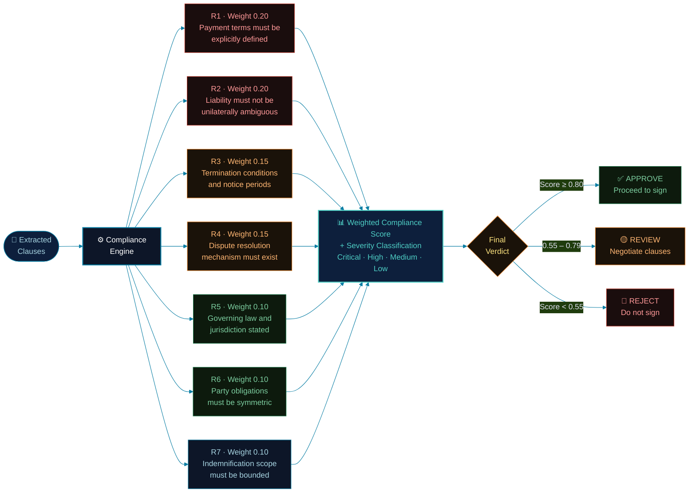

<div align="center">


<br/>


<br/><br/>

<a href="https://aria-contract-intelligence.streamlit.app/" target="_blank">
  
</a>
&nbsp;
<a href="https://github.com/debasmita30/aria-contract-intelligence" target="_blank">
  
</a>

<br/><br/>


&nbsp;

&nbsp;

&nbsp;


<br/><br/>


&nbsp;

&nbsp;

&nbsp;


<br/><br/>


</div>

<br/>

## 📌 Quick Links

<div align="center">

| 🚀 [Live Demo](https://aria-contract-intelligence.streamlit.app/) | ❓ [Problem Statement](#-problem-statement) | 💡 [Solution](#-solution) |
|:---:|:---:|:---:|
| 🏗️ [Architecture](#-system-architecture) | ✨ [Features](#-features) | 🛠️ [Tech Stack](#%EF%B8%8F-tech-stack) |
| ⚡ [Quick Start](#-quick-start) | 📁 [File Structure](#-file-structure) | 🗺️ [Roadmap](#%EF%B8%8F-roadmap) |

</div>

<br/>


<br/>

## ❓ Problem Statement

<div align="center">
```
Enterprises sign 200–500 contracts per quarter.
Every single one is a potential liability waiting to be missed.
```

</div>


```mermaid
%%{init: {'theme': 'base', 'themeVariables': {'primaryColor': '#0D1F3C', 'primaryTextColor': '#E0E0F0', 'primaryBorderColor': '#0A7EA4', 'lineColor': '#0A7EA4', 'secondaryColor': '#0a1628', 'tertiaryColor': '#060d1a', 'background': '#060d1a', 'mainBkg': '#0D1F3C', 'nodeBorder': '#0A7EA4', 'clusterBkg': '#0a1628', 'titleColor': '#E0E0F0', 'edgeLabelBackground': '#0D1F3C', 'fontFamily': 'monospace'}}}%%
flowchart LR
    subgraph PAIN ["🚨 The Enterprise Contract Crisis"]
        direction TB
        A["⏳ Time Drain\n5–7 business days\nper contract review\nper legal team"]
        B["🕳️ Silent Failures\nAI tools produce wrong\noutput with no warning.\nNo reliability signal."]
        C["🔲 Black Box AI\nNo explainability.\nNo audit trail.\nNot enterprise-grade."]
        D["💸 Financial Exposure\n₹2.5M–₹5M unmitigated\ndamages per bad clause\nslip through undetected"]
        E["🔁 No Recovery\nA bad extraction\ncascades downstream.\nHumans fix manually."]
    end

    subgraph SCALE ["📈 Scale of the Problem"]
        direction TB
        F["500+\nContracts/Quarter\nEnterprise Average"]
        G["₹6L Crore\nContractual Value\nat Risk Annually"]
        H["< 12%\nClauses Reviewed\nby AI with Confidence"]
        I["₹0\nSolutions with\nSelf-Healing AI"]
    end

    PAIN --> SCALE

    style A fill:#1a0d0d,stroke:#C0392B,color:#FF9999
    style B fill:#1a1209,stroke:#E67E22,color:#FFB673
    style C fill:#0d1a0d,stroke:#1A7A4A,color:#7DCEA0
    style D fill:#0d0d1a,stroke:#0A7EA4,color:#A8D5E2
    style E fill:#1a0d1a,stroke:#8E44AD,color:#C39BD3
    style F fill:#0D1F3C,stroke:#0A7EA4,color:#0A7EA4
    style G fill:#0D1F3C,stroke:#4ECDC4,color:#4ECDC4
    style H fill:#0D1F3C,stroke:#C0392B,color:#C0392B
    style I fill:#0D1F3C,stroke:#1A7A4A,color:#1A7A4A
    style PAIN fill:#060d1a,stroke:#C0392B,stroke-width:2px,color:#E0E0F0
    style SCALE fill:#060d1a,stroke:#0A7EA4,stroke-width:2px,color:#E0E0F0
```

| # | Problem | Enterprise Impact |
|---|---------|-------------------|
| ⏳ | **Time drain** — Legal teams spend 5–7 days reviewing a single contract manually | 1,000+ person-hours per quarter wasted on repetitive clause checking |
| 🕳️ | **Silent AI failures** — Current tools produce wrong outputs with zero reliability signal | Counsel acts on flawed analysis without knowing it is flawed |
| 🔲 | **Black-box reasoning** — No decision trace, no explainability, no auditability | Non-compliant with enterprise governance and legal review standards |
| 💸 | **Unmitigated exposure** — Ambiguous liability clauses slip through undetected | ₹2.5M–₹5M+ financial exposure per high-risk contract signed blindly |
| 🔁 | **Zero recovery** — A single bad clause extraction cascades into wrong compliance output | Entire analysis pipeline must be restarted manually |
| 📊 | **No benchmarking** — No way to compare risk posture across contract portfolios | Systemic exposure patterns remain invisible until litigation |

<br/>

## 💡 Solution


ARIA is a **production-grade, multi-agent AI system** that transforms raw contract text into a structured risk verdict — and knows exactly what to do when something goes wrong. Unlike any existing tool, ARIA treats reliability as a first-class output, not an afterthought.

<br/>

## 🏗️ System Architecture


<br/>

### 🔄 Agent Interaction & Data Flow

```mermaid
%%{init: {'theme': 'base', 'themeVariables': {'primaryColor': '#0D1F3C', 'primaryTextColor': '#E0E0F0', 'primaryBorderColor': '#0A7EA4', 'lineColor': '#4ECDC4', 'background': '#060d1a', 'mainBkg': '#0D1F3C', 'clusterBkg': '#060d1a', 'titleColor': '#E0E0F0', 'fontFamily': 'monospace'}}}%%
graph LR
    TXT["📄 Contract\nText"] -->|raw input| ORC["orchestrator\n🧠"]
    ORC -->|contract text| EXT["extraction_agent\n📄"]
    EXT -->|clauses + confidence| COM["compliance_agent\n✅"]
    COM -->|violations + score| RSK["risk_agent\n⚠️"]
    RSK -->|"disagreement flag?"| NEG["negotiation_agent\n🤝"]
    EXT & COM & RSK & NEG -->|all AgentResults| FTI["reliability_engine\n📊 FTI Scorer"]
    FTI -->|"FTI score + failure_type"| MON["failure_monitor\n🔍"]
    MON -->|"strategy request"| MEM["memory_store\n📚"]
    MEM -->|"best strategy"| STR["strategy_selector\n🎯"]
    STR -->|"execute"| REC["recovery_agent\n⚡"]
    REC -->|"re-run"| EXT
    REC -->|"outcome"| MEM
    MON -->|"healthy"| OUT["final_output\n📤"]

    style TXT fill:#1a1209,stroke:#E67E22,color:#FFB673
    style ORC fill:#1a0d1a,stroke:#8E44AD,color:#C39BD3
    style EXT fill:#0d1a0d,stroke:#4ECDC4,color:#4ECDC4
    style COM fill:#0d1628,stroke:#0A7EA4,color:#A8D5E2
    style RSK fill:#1a1209,stroke:#E67E22,color:#FFB673
    style NEG fill:#1a0d1a,stroke:#8E44AD,color:#C39BD3
    style FTI fill:#0D1F3C,stroke:#4ECDC4,color:#4ECDC4,stroke-width:2px
    style MON fill:#1a0d0d,stroke:#C0392B,color:#FF9999,stroke-width:2px
    style MEM fill:#0d1a0d,stroke:#1A7A4A,color:#7DCEA0
    style STR fill:#0D1F3C,stroke:#0A7EA4,color:#A8D5E2
    style REC fill:#1a1209,stroke:#E67E22,color:#FFB673
    style OUT fill:#0d1628,stroke:#4ECDC4,stroke-width:2px,color:#4ECDC4
```


<br/>

### 🧮 FTI — Failure Threshold Index


<br/>

### 🔄 Recovery Strategy Selection


<br/>

### 🔍 Compliance Rule Engine


<br/>

## ✨ Features

<table>
<tr>
<td width="50%" valign="top">

### 🤖 Multi-Agent Orchestration
- **6 specialized agents** with explicit role boundaries and structured JSON outputs
- Every agent returns a **self-assessed confidence score** (0.0 – 1.0)
- Upstream failures propagate as **confidence penalties**, not silent errors
- Agent disagreement is **detected, flagged, and arbitrated** automatically

### 📊 FTI Reliability Scoring
- Formula-driven **Failure Threshold Index** from weighted confidence, cross-agent consistency, and contract complexity
- Real-time **status classification**: Healthy / Degraded / Critical
- Every metric is **computed from actual LLM outputs** — nothing hardcoded
- Per-agent **contribution breakdown** in audit log

### 🔄 Autonomous Self-Healing
- **5 recovery strategies**: Retry, Simplify+Retry, Decompose, Negotiate, Fallback
- Strategy selected by **failure type classification** + memory guidance
- Recovery re-runs agents and **recomputes FTI** to verify improvement
- System **never crashes** — Fallback guarantee is rule-based and always succeeds

### 🤝 Agent Negotiation
- Dedicated **Negotiation Agent** arbitrates when Risk and Compliance agents conflict
- Identifies **root cause of disagreement** and dominant evidence
- Produces **reconciled compliance and risk scores** with explanation
- Disagreement delta tracked and logged for audit

</td>
<td width="50%" valign="top">

### 📋 Explainable Decision Trace
- Every agent decision, confidence score, warning, and recovery action logged in **structured JSON**
- Full **before-vs-after FTI comparison** after recovery execution
- Decision graph exportable for **compliance evidence**
- Human-readable **reasoning narrative** per agent

### ✏️ Autonomous Redline
- Self-healed contracts with **clause-by-clause rewrites** in compliant legal language
- **Adversarial exploitation analysis** — simulates how a bad-faith party could weaponize ambiguous clauses
- Side-by-side **diff view** of original vs rewritten clause
- Executable without legal counsel for first-pass triage

### 💬 Ask ARIA — Interactive RAG
- Contract-context **Q&A chat** using retrieval-augmented generation
- One-click **suggested demo queries** for guided exploration
- Multi-turn conversation with **full history**
- Answers grounded in extracted clauses, not hallucinated

### 📦 Batch Processing
- Upload **ZIP or CSV batch** for multi-contract portfolio analysis
- Per-contract risk summary with **portfolio-level exposure rollup**
- Suitable for **M&A due diligence** and vendor onboarding sweeps
- Exportable batch report in structured format

</td>
</tr>
</table>

<br/>

## 🆚 ARIA vs Typical AI Tools

<div align="center">

| Capability | 🛡️ ARIA | ❌ Typical AI Tool |
|---|---|---|
| **Failure Handling** | Self-heals autonomously with 5 strategies | Fails silently, no notification |
| **Reliability Signal** | FTI score computed per run, always visible | No reliability output exists |
| **Explainability** | Full structured decision trace, exportable | Black box — output only |
| **Agent Coordination** | Multi-agent negotiation on conflict | Single-model, single pass |
| **Memory** | Learns from past failures to improve strategy | Stateless per request |
| **Recovery** | Autonomous — zero human intervention | Manual restart required |
| **Audit Trail** | JSON export, compliance-grade | No logging |
| **Confidence** | Per-agent, formula-derived, propagated | Absent or fabricated |

</div>

> **The core distinction:** ARIA is the only contract AI system that treats its own reliability as a first-class output and acts on it without human intervention.

<br/>

## 🛠️ Tech Stack

<div align="center">

| Layer | Technology | Purpose |
|-------|-----------|---------|
| **UI Framework** |  | 8-tab interactive enterprise dashboard |
| **LLM Backbone** |  | All agent reasoning and structured outputs |
| **Data Processing** |   | ETL, contract feature extraction |
| **Orchestration** | Custom Python Agent Framework | Multi-agent pipeline with confidence propagation |
| **Reliability Engine** | Custom FTI Formula | Weighted confidence × consistency ÷ complexity |
| **Memory Store** | JSON persistence + feature-signature matching | Strategy effectiveness learning |
| **Recovery Engine** | 5-strategy adaptive system | Autonomous self-healing |
| **Language** |  | Core runtime |
| **Deployment** |  | Public demo hosting |

</div>

<br/>

## ⚡ Quick Start
```bash
# 1. Clone the repository
git clone https://github.com/debasmita30/aria-contract-intelligence.git
cd aria-contract-intelligence

# 2. Create and activate virtual environment
python -m venv venv
source venv/bin/activate          # macOS / Linux
venv\Scripts\activate             # Windows

# 3. Install dependencies
pip install -r requirements.txt

# 4. Set your Anthropic API key
mkdir -p .streamlit
echo 'ANTHROPIC_API_KEY = "sk-ant-your-key-here"' > .streamlit/secrets.toml

# 5. Launch ARIA
streamlit run app.py
```

Open **http://localhost:8501** — tick **"Use Sample Contract"** in the sidebar for an instant demo with a pre-loaded adversarial contract.

<br/>

## 📁 File Structure
```
aria-contract-intelligence/
│
├── 📄 app.py                          # Main Streamlit dashboard — 8 tabs
├── 📋 requirements.txt                # All dependencies
├── 📖 README.md                       # This file
│
├── 🔐 .streamlit/
│   └── secrets.toml                   # ANTHROPIC_API_KEY (gitignored)
│
├── 📁 core/
│   ├── __init__.py
│   ├── agents.py                      # All 6 agent classes with Claude API calls
│   │                                  #   ExtractionAgent · ComplianceAgent
│   │                                  #   RiskAgent · NegotiationAgent
│   │                                  #   StrategyAgent · RecoveryAgent
│   ├── reliability.py                 # FTI formula engine + failure classification
│   ├── memory.py                      # Persistent memory store with similarity matching
│   ├── strategies.py                  # 5 recovery strategy implementations
│   └── workflow_engine.py             # Orchestrator — full pipeline execution
│
└── 📁 logs/                           # Auto-created at runtime
    ├── audit_log.json                 # Per-run decision trace
    ├── decision_graph.json            # Step-by-step execution graph
    └── memory.json                    # Failure + recovery history store
```

<br/>

## 🔬 How It Works — Step by Step

| Step | Stage | Description |
|------|-------|-------------|
| **01** | Input Ingestion | Contract text or batch upload received by Orchestrator Agent |
| **02** | Clause Extraction | Extraction Agent parses all clauses, identifies parties, flags ambiguous language, returns confidence score |
| **03** | Compliance Analysis | Compliance Agent checks 7 enterprise rules with severity weighting; inherits upstream confidence penalty |
| **04** | Risk Scoring | Risk Engine computes financial exposure, detects logical disagreements between Compliance and Extraction outputs |
| **05** | Agent Negotiation | If disagreement delta > 0.35, Negotiation Agent arbitrates and produces reconciled view |
| **06** | FTI Computation | Reliability Engine computes FTI from weighted confidence, cross-agent consistency, and contract complexity |
| **07** | Failure Detection | Failure Monitor classifies failure type if FTI < 0.65 and routes to recovery pipeline |
| **08** | Strategy Selection | Strategy Selector queries Memory Store for historically best strategy; falls back to failure-type priority table |
| **09** | Recovery Execution | Recovery Agent executes chosen strategy, re-runs affected agents, recomputes FTI to verify improvement |
| **10** | Output Generation | Final verdict (APPROVE / REVIEW / REJECT), autonomous redline, audit log, and RAG chat activated |

<br/>

## 📸 Screenshots

<table>
<tr>
<td align="center" width="50%">
<b>REJECT Verdict + FTI Dashboard</b><br/>

<sub>ARIA issues REJECT verdict with FTI 0.620, $2.5M–$5.0M exposure, 3 critical violations flagged</sub>
</td>
<td align="center" width="50%">
<b>Autonomous Redline + Adversarial Analysis</b><br/>

<sub>Self-healed clause rewrites with side-by-side diff and adversarial exploitation simulation</sub>
</td>
</tr>
<tr>
<td align="center" width="50%">
<b>Ask ARIA — Interactive Contract RAG</b><br/>

<sub>Multi-turn Q&A grounded in extracted clauses — liability cap, termination conditions, penalties</sub>
</td>
<td align="center" width="50%">
<b>Recovery Trace — Before vs After FTI</b><br/>

<sub>System self-heals from FTI 0.42 (critical) to 0.78 (healthy) via Simplify+Retry strategy</sub>
</td>
</tr>
</table>

> **Replace placeholder images above** with actual screenshots from https://aria-contract-intelligence.streamlit.app/

<br/>

## 💼 Business Impact

<div align="center">

| Metric | Before ARIA | With ARIA | Impact |
|--------|------------|-----------|--------|
| **Time to Analyze** | 5–7 business days | Under 60 seconds | 99% reduction |
| **Clause Coverage** | Human fatigue-limited | Systematic 7-rule check | 100% coverage |
| **Recovery on Failure** | Manual restart | Autonomous — 5 strategies | Zero human retry |
| **Audit Trail** | Email chains and notes | Structured JSON export | Fully traceable |
| **Risk Detection** | Post-signature discovery | Pre-signature with FTI | Prevents exposure |
| **Scalability** | Linear to headcount | Batch — unlimited scale | Horizontal scale |

</div>

A mid-enterprise processing 200 contracts per quarter at 5 hours each spends **1,000+ person-hours per quarter** on contract review. ARIA reduces this to under **4 hours of AI-assisted triage** — with higher clause coverage and a complete audit trail.

<br/>

## 🗺️ Roadmap

- [ ] 📡 Real-time contract monitoring — webhook integration for post-signature clause change detection
- [ ] 🏦 Legal system connectors — DocuSign, Ironclad, Salesforce CLM native integration
- [ ] 🎯 Domain fine-tuning — jurisdiction-specific clause libraries (GDPR, HIPAA, UCC, Indian Contract Act)
- [ ] 📊 Portfolio intelligence — cross-contract pattern detection for systemic exposure analysis
- [ ] 📱 PWA mobile mode — ARIA on-the-go for in-meeting contract triage
- [ ] 🔔 Breach alerts — WhatsApp / email notification on deadline or obligation triggers
- [ ] 🌍 Multi-language — Hindi, regional Indian language contract parsing

<br/>

## 🤝 Contributing

Contributions are welcome.

1. Fork the repository
2. Create your feature branch — `git checkout -b feature/YourFeature`
3. Commit your changes — `git commit -m 'Add YourFeature'`
4. Push to the branch — `git push origin feature/YourFeature`
5. Open a Pull Request

<br/>

---

<div align="center">


<br/>

**Built for ET GenAI Hackathon 2025 — Enterprise AI Track**

<br/>

[](https://aria-contract-intelligence.streamlit.app/)

<br/>

*ARIA — Built to be trusted, not just used.*

</div>
